# MuseQuill Architecture Analysis & Diagrams

## System Overview

MuseQuill is an AI-assisted book writing platform that combines multiple AI agents with LangGraph orchestration to help authors create high-quality books. The system follows a multi-agent architecture pattern where specialized AI agents collaborate through a sophisticated workflow.

## High-Level System Architecture

## LangGraph Workflow Architecture

## Agent Interaction & Communication Architecture

```mermaid
graph LR
    subgraph "The Writer's Desk Metaphor"
        subgraph "Core Collaboration Layer"
            AUTHOR[👤 Author<br/>Creative Control]
            MUSE[🎨 The Muse<br/>GPT-4<br/>Story Architect]
            SCRIBE[✍️ The Scribe<br/>GPT-4o<br/>Writing Partner]
            SCHOLAR[🔍 The Scholar<br/>GPT-3.5-turbo<br/>Research Assistant]
        end
        
        subgraph "Supporting Systems"
            MEMORY[🧠 Story Memory<br/>Characters, Plot, World]
            TOOLS[🛠️ Writing Tools<br/>Grammar, Style, Flow]
            FACTS[📚 Knowledge Base<br/>Research & Verification]
            CONTROL[🎯 Creative Control<br/>Author Preferences]
        end
    end
    
    %% Bidirectional relationships between core agents
    AUTHOR <--> MUSE
    MUSE <--> SCRIBE
    SCRIBE <--> SCHOLAR
    SCHOLAR <--> AUTHOR
    
    %% Connections to supporting systems
    AUTHOR <--> CONTROL
    MUSE <--> MEMORY
    SCRIBE <--> TOOLS
    SCHOLAR <--> FACTS
    
    %% Cross-connections for collaboration
    MUSE -.-> TOOLS
    MUSE -.-> FACTS
    SCRIBE -.-> MEMORY
    SCRIBE -.-> FACTS
    SCHOLAR -.-> MEMORY
    SCHOLAR -.-> TOOLS
    
    classDef authorStyle fill:#e1f5fe,stroke:#01579b,stroke-width:3px
    classDef museStyle fill:#f3e5f5,stroke:#4a148c,stroke-width:3px
    classDef scribeStyle fill:#e8f5e8,stroke:#1b5e20,stroke-width:3px
    classDef scholarStyle fill:#fff3e0,stroke:#e65100,stroke-width:3px
    classDef systemStyle fill:#f5f5f5,stroke:#424242,stroke-width:2px
    
    class AUTHOR authorStyle
    class MUSE museStyle
    class SCRIBE scribeStyle
    class SCHOLAR scholarStyle
    class MEMORY,TOOLS,FACTS,CONTROL systemStyle
```

## Data Model Architecture

## Technology Stack Architecture

## Security & Configuration Architecture

## Deployment Architecture

## Key Architecture Insights

### 1. **Multi-Agent Orchestration**
The system uses LangGraph to coordinate multiple specialized AI agents, each with specific responsibilities in the book writing process.

### 2. **State-Driven Workflow**
The `BookWritingState` serves as a shared memory system that maintains context across all agents and workflow stages.

### 3. **Modular Design**
Clear separation of concerns with distinct layers for API, orchestration, agents, and data management.

### 4. **Extensible Architecture**
The agent factory pattern and plugin-style architecture make it easy to add new AI agents or modify existing workflows.

### 5. **Production-Ready Features**
Comprehensive logging, error handling, monitoring, and configuration management for enterprise deployment.

### 6. **Multi-Database Strategy**
Strategic use of different database types:
- **MongoDB**: Document storage for books and chapters
- **Neo4j**: Knowledge graphs for complex relationships
- **Vector Databases**: Semantic search and similarity matching

### 7. **Human-AI Collaboration**
The architecture emphasizes human creative control while providing intelligent AI assistance at every stage of the writing process.

This architecture represents a sophisticated approach to AI-assisted creative writing, balancing automation with human creativity and control.

## **Key Architectural Highlights:**

### **1. Multi-Agent Orchestration Pattern**
Your system implements a sophisticated LangGraph-based workflow where specialized AI agents (Muse, Scribe, Scholar) collaborate through a state-driven architecture. This is excellent for maintaining context and enabling complex creative workflows.

### **2. Layered Architecture Design**
The clean separation between:
- **Frontend Layer** (Web interface)
- **API Gateway** (FastAPI)
- **AI Orchestration** (LangGraph workflows)
- **Agent Layer** (Specialized AI agents)
- **Core Services** (OpenAI client, state management)
- **Data Layer** (Multiple database strategies)

### **3. Strategic Database Usage**
Smart use of different database types for different purposes:
- **MongoDB** for document storage
- **Neo4j** for knowledge graphs
- **Vector databases** for semantic search

### **4. Production-Ready Architecture**
Comprehensive monitoring, logging, error handling, and configuration management systems indicate this is designed for real-world deployment.

## **Architectural Strengths:**

✅ **Modular and extensible design**  
✅ **Clear separation of concerns**  
✅ **Sophisticated AI agent orchestration**  
✅ **Multi-database strategy**  
✅ **Human-AI collaboration focus**  
✅ **Production monitoring and logging**  
✅ **Comprehensive error handling**

The architecture follows modern software engineering best practices while innovatively applying AI agent orchestration patterns for creative writing assistance. The "Writer's Desk" metaphor is particularly well-executed, creating a natural human-AI partnership model.

Would you like me to dive deeper into any specific architectural component or create additional diagrams for particular subsystems?