# MuseQuill Complete Orchestration Sequence Diagram

This sequence diagram shows the complete workflow from MonitorServiceManager initialization through the AI agent pipeline to final book generation and storage.

```mermaid
sequenceDiagram
    participant MSM as MonitorServiceManager
    participant BM as BookMonitor
    participant MONGO as MongoDB
    participant REDIS as Redis Queue
    participant BR as BookRetriever
    participant ORCH as LangGraph Orchestrator
    participant RP as ResearchPlannerAgent
    participant RE as ResearcherAgent
    participant RV as ResearchValidatorAgent
    participant WP as WritingPlannerAgent
    participant CW as ChapterWriterAgent
    participant QR as QualityReviewerAgent
    participant FA as FinalAssemblerAgent
    participant BS as BookStorerAgent
    participant VDB as Vector Database
    participant SEARCH as Search APIs
    
    %% 1. MonitorServiceManager Initialization
    Note over MSM: Application Startup
    MSM->>MSM: __init__()
    MSM->>MSM: _initialize_services()
    MSM->>BM: BookMonitor()
    BM->>MSM: instance created
    MSM->>BR: BookRetriever(config)
    BR->>MSM: instance created
    MSM->>MSM: register shutdown handlers
    
    %% 2. Starting Services
    MSM->>MSM: start_all()
    MSM->>BM: start()
    BM->>BM: initialize connections
    BM->>MONGO: connect and authenticate
    MONGO->>BM: connection established
    BM->>REDIS: connect to queue
    REDIS->>BM: connection established
    BM->>BM: start monitor_thread
    BM->>MSM: service started
    
    MSM->>BR: start()
    BR->>BR: initialize connections
    BR->>REDIS: connect to queue
    REDIS->>BR: connection established
    BR->>MONGO: connect to database
    MONGO->>BR: connection established
    BR->>BR: start retriever_thread
    BR->>MSM: service started
    
    %% 3. BookMonitor Scanning and Processing
    loop Book Monitoring Loop
        BM->>MONGO: find books with status='planned' and planning_completed=True
        MONGO->>BM: ready books found
        
        alt Books Found
            BM->>BM: validate_book_for_writing()
            BM->>BM: format_book_for_queue()
            BM->>MONGO: update book status to 'queued_for_writing'
            MONGO->>BM: status updated
            BM->>REDIS: lpush book to queue
            REDIS->>BM: book queued successfully
            Note over BM,REDIS: Book pushed to Redis queue atomically
        else No Books Ready
            BM->>BM: sleep(poll_interval)
        end
    end
    
    %% 4. BookRetriever Processing
    loop Book Retrieval Loop
        BR->>REDIS: blpop from queue (with timeout)
        REDIS->>BR: book data retrieved
        
        alt Book Retrieved
            BR->>BR: validate_book_data()
            BR->>BR: normalize_book_data()
            BR->>BR: create_initial_agent_state()
            BR->>BR: start_orchestration()
            
            %% 5. Orchestration Setup
            BR->>BR: create_checkpointer()
            BR->>ORCH: create_book_writing_graph(checkpointer)
            ORCH->>ORCH: build StateGraph with all nodes
            ORCH->>ORCH: set_entry_point(RESEARCH_PLANNER)
            ORCH->>ORCH: add_edges and conditional_edges
            ORCH->>ORCH: compile(checkpointer, debug=True)
            ORCH->>BR: graph created
            
            BR->>BR: add to active_orchestrations
            BR->>BR: submit to ThreadPoolExecutor
            BR->>BR: orchestration started
            
            %% 6. LangGraph Workflow Execution
            Note over ORCH: Graph Execution Begins
            ORCH->>RP: research_planning_node(state)
            RP->>RP: analyze book outline
            RP->>RP: create_research_plan()
            RP->>RP: generate research queries
            RP->>ORCH: state updated with research_strategy and queries
            
            ORCH->>RE: research_execution_node(state)
            loop For Each Research Query
                RE->>SEARCH: execute search query
                SEARCH->>RE: search results
                RE->>RE: process and store results
                RE->>VDB: store research chunks with embeddings
                VDB->>RE: chunks stored
            end
            RE->>ORCH: state updated with research_data
            
            ORCH->>RV: research_validation_node(state)
            RV->>RV: validate_research_completeness()
            RV->>RV: assess research quality and coverage
            alt Research Sufficient
                RV->>ORCH: state.research_complete = True
            else More Research Needed
                RV->>RV: generate additional queries
                RV->>ORCH: state with additional_queries
                ORCH->>RE: research_execution_node(state) [retry]
                Note over RE: Additional research cycle
                RE->>ORCH: updated state
                RV->>ORCH: validation complete
            end
            
            ORCH->>WP: writing_planning_node(state)
            WP->>WP: create_writing_strategy()
            WP->>WP: generate style_guide
            WP->>WP: plan chapter structure
            WP->>ORCH: state updated with writing_plan
            
            %% 7. Chapter Writing Loop
            loop For Each Chapter
                ORCH->>CW: chapter_writing_node(state)
                CW->>VDB: retrieve relevant research chunks
                VDB->>CW: contextual research data
                CW->>CW: generate chapter content
                CW->>CW: apply writing style and guidelines
                CW->>CW: update chapter status
                CW->>ORCH: state updated with completed chapter
                
                ORCH->>ORCH: should_continue_writing()
                alt More Chapters to Write
                    Note over ORCH: Continue to next chapter
                else All Chapters Complete
                    Note over ORCH: Move to quality review
                end
            end
            
            ORCH->>QR: quality_review_node(state)
            QR->>QR: analyze content quality
            QR->>QR: check consistency and flow
            QR->>QR: generate review_notes
            QR->>QR: calculate quality_score
            QR->>ORCH: state updated with quality assessment
            
            ORCH->>ORCH: should_revise_or_complete()
            alt Quality Score Low or Revision Required
                Note over ORCH: Route back to chapter_writer
                ORCH->>CW: chapter_writing_node(state) [revision]
                Note over CW: Revision cycle with quality feedback
                CW->>ORCH: revised content
            else Quality Acceptable
                Note over ORCH: Proceed to final assembly
            end
            
            ORCH->>FA: final_assembly_node(state)
            FA->>FA: assemble_final_book()
            FA->>FA: format content for output
            FA->>FA: generate metadata
            FA->>FA: create final book structure
            FA->>ORCH: state updated with final_book_content
            
            ORCH->>BS: book_storage_node(state)
            BS->>MONGO: store completed book
            MONGO->>BS: book stored successfully
            BS->>BS: update book status to 'completed'
            BS->>BS: generate completion metrics
            BS->>ORCH: state updated with storage confirmation
            
            ORCH->>ORCH: is_processing_complete()
            ORCH->>BR: orchestration complete
            
            %% 8. Cleanup
            BR->>BR: remove from active_orchestrations
            BR->>BR: update statistics
            BR->>BR: cleanup_completed_orchestrations()
            
        else No Books in Queue
            BR->>BR: continue monitoring
        end
    end
    
    %% 9. Service Status and Health Monitoring
    Note over MSM: Ongoing Health Monitoring
    loop Health Check Loop
        MSM->>BM: get_status()
        BM->>MSM: service status
        MSM->>BR: get_status()
        BR->>MSM: service status
        MSM->>MSM: compile health_data
    end
```

## Key Orchestration Insights

### 1. **MonitorServiceManager Coordination**
- **Centralized Management**: MSM manages both BookMonitor and BookRetriever lifecycle
- **Service Health Tracking**: Continuous monitoring of service status
- **Graceful Shutdown**: Coordinated shutdown with signal handlers

### 2. **BookMonitor Processing Pipeline**
- **Atomic Status Updates**: Uses MongoDB's `find_one_and_update` for race condition prevention
- **Book Validation**: Comprehensive validation before queueing
- **Queue Management**: Uses Redis LPUSH for FIFO queue behavior
- **Error Handling**: Invalid books are marked with error status

### 3. **BookRetriever Orchestration Management**
- **Concurrent Processing**: ThreadPoolExecutor for parallel orchestrations
- **Capacity Management**: Limits concurrent orchestrations to prevent resource exhaustion
- **State Creation**: Transforms book data into LangGraph BookWritingState
- **Checkpointer Selection**: Redis or Memory-based state persistence

### 4. **LangGraph Agent Pipeline**
- **Research Phase**: Planning → Execution → Validation (with retry loops)
- **Writing Phase**: Planning → Chapter Writing (iterative) → Quality Review
- **Assembly Phase**: Final assembly → Storage
- **State Management**: Persistent state across all agent interactions
- **Conditional Routing**: Dynamic flow control based on state conditions

### 5. **Agent Interaction Patterns**
- **Sequential Execution**: Agents execute in defined sequence with state handoff
- **Conditional Loops**: Research validation and chapter writing use retry loops
- **External Integrations**: Search APIs for research, Vector DB for storage
- **Error Recovery**: Each agent includes error handling and state recovery

### 6. **Quality and Revision Control**
- **Iterative Improvement**: Quality reviewer can trigger chapter rewrites
- **Revision Limits**: Maximum revision count prevents infinite loops
- **Quality Thresholds**: Configurable quality scores for approval
- **Human Oversight**: Strategic interruption points for manual review

This sequence demonstrates a sophisticated production-ready AI orchestration system that balances automation with quality control, scalability with resource management, and reliability with performance.

## **Critical Architectural Patterns Revealed:**

### **1. Service Orchestration Pattern**
- **MonitorServiceManager** acts as the central coordinator, managing both BookMonitor and BookRetriever
- **Atomic State Management** using MongoDB's `find_one_and_update` to prevent race conditions
- **Redis Queue** as the reliable message broker between components

### **2. Multi-Stage Processing Pipeline**
The system implements a sophisticated **8-stage AI pipeline**:
1. **Research Planning** - Generates research strategy and queries
2. **Research Execution** - Executes searches and stores in vector DB
3. **Research Validation** - Validates completeness (with retry loops)
4. **Writing Planning** - Creates writing strategy and style guide
5. **Chapter Writing** - Iterative chapter generation with context
6. **Quality Review** - Content quality assessment with revision triggers
7. **Final Assembly** - Book compilation and formatting
8. **Book Storage** - Final storage and status updates

### **3. Intelligent Flow Control**
- **Conditional Loops**: Research validation can trigger additional research cycles
- **Quality Gates**: Quality reviewer can route back to chapter writer for revisions
- **Revision Limits**: Maximum revision counts prevent infinite loops
- **Capacity Management**: Concurrent orchestration limits prevent resource exhaustion

### **4. State-Driven Architecture**
- **BookWritingState** serves as shared memory across all agents
- **LangGraph Checkpointing** provides state persistence and recovery
- **Progress Tracking** with percentage completion and estimated times
- **Error Collection** for comprehensive debugging and recovery

### **5. Production-Ready Features**
- **Thread Safety**: Proper threading with shutdown events
- **Error Handling**: Comprehensive error capture and dead letter queues
- **Resource Management**: Thread pool executors and connection pooling
- **Health Monitoring**: Continuous service status tracking

## **Unique Strengths of This Architecture:**

✅ **Atomic Book Processing** - Race condition prevention  
✅ **Intelligent Retry Logic** - Research and quality validation loops  
✅ **Resource-Aware Scaling** - Concurrent orchestration limits  
✅ **Comprehensive State Management** - Full workflow persistence  
✅ **Production Monitoring** - Real-time health and status tracking  
✅ **Graceful Degradation** - Error handling at every stage  

The sequence diagram shows how BookRetriever orchestrates the entire agent pipeline through LangGraph's sophisticated state machine, with each agent contributing specialized capabilities while maintaining shared context through the BookWritingState.

