# MuseQuill.ink - High-Level Architecture Blueprint

## Core Philosophy

**"AI-Assisted Creative Partnership, Not Replacement"**

MuseQuill.ink is designed as a creative partner that enhances human creativity rather than replacing it. The system follows the proven creative writing workflow while providing intelligent assistance at each stage.

## The Natural Creative Writing Workflow

Based on research, the fundamental creative writing process consists of:

1. **Inspiration & Ideation** - The spark of an idea
2. **Planning & Structure** - Outline, characters, world-building
3. **Research & Context** - Authenticity and accuracy gathering
4. **Drafting** - The actual writing process
5. **Revision & Refinement** - Iterative improvement
6. **Editing & Polish** - Final quality assurance

## MuseQuill.ink System Design

### **Core Architecture Principle: The Writer's Desk Metaphor**

Think of MuseQuill.ink as an intelligent writer's desk with these key assistants:

```mermaid
graph TB
    subgraph "MuseQuill.ink - The Writer's Desk"
        subgraph "Core Collaboration Layer"
            AUTHOR[👤 Author<br/>Creative Control]
            MUSE[🎨 The Muse<br/>GPT-4<br/>Story Architect]
            SCRIBE[✍️ The Scribe<br/>GPT-4o<br/>Writing Partner]
            SCHOLAR[🔍 The Scholar<br/>GPT-3.5-turbo<br/>Research Assistant]
        end
        
        subgraph "Supporting Systems"
            MEMORY[🧠 Story Memory<br/>Characters, Plot, World]
            TOOLS[🛠️ Writing Tools<br/>Grammar, Style, Flow]
            FACTS[📚 Knowledge Base<br/>Research & Verification]
            CONTROL[🎯 Creative Control<br/>Author Preferences]
        end
    end
    
    %% Bidirectional relationships between core agents
    AUTHOR <--> MUSE
    MUSE <--> SCRIBE
    SCRIBE <--> SCHOLAR
    SCHOLAR <--> AUTHOR
    
    %% Connections to supporting systems
    AUTHOR <--> CONTROL
    MUSE <--> MEMORY
    SCRIBE <--> TOOLS
    SCHOLAR <--> FACTS
    
    %% Cross-connections for collaboration
    MUSE -.-> TOOLS
    MUSE -.-> FACTS
    SCRIBE -.-> MEMORY
    SCRIBE -.-> FACTS
    SCHOLAR -.-> MEMORY
    SCHOLAR -.-> TOOLS
    
    %% Styling
    classDef authorStyle fill:#e1f5fe,stroke:#01579b,stroke-width:3px,color:#000
    classDef museStyle fill:#f3e5f5,stroke:#4a148c,stroke-width:3px,color:#000
    classDef scribeStyle fill:#e8f5e8,stroke:#1b5e20,stroke-width:3px,color:#000
    classDef scholarStyle fill:#fff3e0,stroke:#e65100,stroke-width:3px,color:#000
    classDef systemStyle fill:#f5f5f5,stroke:#424242,stroke-width:2px,color:#000
    
    class AUTHOR authorStyle
    class MUSE museStyle
    class SCRIBE scribeStyle
    class SCHOLAR scholarStyle
    class MEMORY,TOOLS,FACTS,CONTROL systemStyle
```

### **The Key AI Assistants**

#### **1. The Muse** (GPT-4 - Creative Director)
**Role**: Creative guidance and story architecture
**Personality**: Inspiring, strategic, big-picture thinker

**Core Functions**:
- Story concept development and refinement
- Character arc planning and consistency
- Plot structure and pacing guidance
- Creative problem-solving and brainstorming
- Quality oversight and creative direction

**Tools & Capabilities**:
- Story outline generation
- Character development worksheets
- Plot hole detection and resolution
- Creative writing prompts and exercises
- Thematic analysis and development

#### **2. The Scribe** (GPT-4o - Writing Specialist)
**Role**: Active writing partner and prose craftsperson
**Personality**: Supportive, detail-oriented, stylistically aware

**Core Functions**:
- Scene and chapter drafting assistance
- Dialogue generation and refinement
- Descriptive writing enhancement
- Style and voice consistency
- Real-time writing feedback

**Tools & Capabilities**:
- Sentence and paragraph completion
- Dialogue polishing
- Scene expansion and compression
- Writing style adaptation
- Grammar and flow enhancement

#### **3. The Scholar** (GPT-3.5-turbo - Research Assistant)
**Role**: Research, fact-checking, and world-building support
**Personality**: Meticulous, knowledgeable, detail-focused

**Core Functions**:
- Multi-source research coordination
- Fact verification and accuracy checking
- Historical and cultural context gathering
- Technical detail validation
- Reference and citation management

**Tools & Capabilities**:
- Web research integration (Tavily, Brave, DuckDuckGo)
- Fact database building and querying
- Cultural and historical accuracy checking
- Technical detail verification
- Research synthesis and organization

### **The Writer's Memory System**

### **The Creative Workflow Engine**

## Key Design Principles

### **1. Human-AI Partnership**
- **Author maintains creative control** - AI provides suggestions, human makes decisions
- **Transparent AI reasoning** - Always show why AI made specific suggestions
- **Incremental assistance** - Help with small steps, not complete automation
- **Respectful interruption** - AI waits for invitation to contribute

### **2. Context-Aware Intelligence**
- **Memory persistence** - Remember everything across sessions
- **Context layering** - Understand scene, chapter, book, and series context
- **Character consistency** - Track character development and prevent contradictions
- **World-building coherence** - Maintain consistent fictional world rules

### **3. Adaptive Writing Styles**
- **Genre awareness** - Understand conventions of different genres
- **Voice consistency** - Learn and maintain the author's unique voice
- **Style evolution** - Allow natural style development over time
- **Audience adaptation** - Adjust recommendations based on target audience

### **4. Research Integration**
- **Seamless research** - Integrate research without breaking creative flow
- **Multi-source validation** - Cross-check facts from multiple sources
- **Citation tracking** - Maintain research trails for fact verification
- **Cultural sensitivity** - Ensure respectful representation of cultures

## Technical Architecture

### **System Components**

### **Data Flow Architecture**

## User Experience Design

### **The Writer's Journey**

#### **Phase 1: Inspiration (The Spark)**
- **Author Input**: Idea, theme, or prompt
- **Muse Response**: Concept development and expansion
- **Outcome**: Rich story concept with potential directions

#### **Phase 2: Architecture (The Blueprint)**
- **Author Input**: Preferred concept direction
- **Muse Response**: Structure planning and character development
- **Scholar Support**: Research needs identification
- **Outcome**: Comprehensive story outline and research plan

#### **Phase 3: Foundation (The Research)**
- **Scholar Lead**: Multi-source research execution
- **Muse Integration**: Research synthesis with story needs
- **Outcome**: Fact-checked foundation for authentic writing

#### **Phase 4: Creation (The Writing)**
- **Scribe Lead**: Active writing assistance
- **Muse Guidance**: Story arc and pacing oversight
- **Scholar Validation**: Real-time fact checking
- **Outcome**: Quality draft chapters with consistent voice

#### **Phase 5: Refinement (The Polish)**
- **Collaborative Review**: All agents provide feedback
- **Scribe Focus**: Language and style refinement
- **Muse Oversight**: Story coherence and impact
- **Outcome**: Publication-ready manuscript

### **Interface Design Philosophy**

#### **Distraction-Free Writing Environment**
- Clean, minimal interface focused on writing
- AI suggestions appear as subtle overlays
- Easy to accept, modify, or dismiss AI input
- No intrusive interruptions to creative flow

#### **Contextual AI Assistance**
- Right-click menus for AI suggestions
- Sidebar for research and notes
- Real-time grammar and style hints
- Character and plot consistency alerts

#### **Transparent AI Reasoning**
- Always show why AI made suggestions
- Provide confidence levels for AI outputs
- Allow authors to teach AI their preferences
- Maintain detailed logs of AI contributions

## Success Metrics & Goals

### **Author Success Metrics**
- **Writing Velocity**: 50% increase in words per session
- **Quality Consistency**: Reduced plot holes and character inconsistencies
- **Research Integration**: 80% reduction in research time
- **Creative Satisfaction**: High author satisfaction with AI partnership

### **Technical Success Metrics**
- **Response Time**: <2s for most AI suggestions
- **Accuracy Rate**: >95% factual accuracy in research
- **System Reliability**: 99.9% uptime
- **Cost Efficiency**: Optimal model selection for each task

### **Business Success Metrics**
- **User Retention**: 80% monthly active user retention
- **Book Completion**: 60% of started books reach completion
- **User Growth**: Sustainable growth through word-of-mouth
- **Revenue**: Profitable subscription model

## Implementation Roadmap

### **Phase 1: Foundation (Months 1-3)**
- Core AI agent framework
- Basic memory system (knowledge graph + vector store)
- Simple web interface for story creation
- OpenAI integration with cost management

### **Phase 2: Core Features (Months 4-6)**
- Full Muse, Scribe, Scholar implementation
- Research integration (Tavily, Brave, DuckDuckGo)
- Advanced memory management and context awareness
- Real-time collaborative writing interface

### **Phase 3: Enhancement (Months 7-9)**
- Advanced style and voice learning
- Multi-project management
- Collaboration features for co-authors
- Mobile applications

### **Phase 4: Scale (Months 10-12)**
- Performance optimization
- Advanced analytics and insights
- Publishing integration
- Enterprise features for teams

## Competitive Differentiation

### **vs. Generic AI Writing Tools (Jasper, Copy.ai)**
- **Specialized for creative fiction** rather than marketing copy
- **Deep story memory** that maintains context across entire books
- **Multi-agent collaboration** instead of single AI responses

### **vs. Fiction AI Tools (Sudowrite)**
- **Comprehensive workflow support** from idea to finished book
- **Integrated research capabilities** for authentic world-building
- **Collaborative AI partnership** rather than just writing assistance

### **vs. Traditional Writing Software (Scrivener)**
- **Intelligent creative assistance** beyond just organization
- **Automated research and fact-checking** capabilities
- **AI-powered consistency checking** for characters and plot

## Conclusion

MuseQuill.ink represents a new paradigm in creative writing assistance - not replacing human creativity, but amplifying it through intelligent AI partnership. By focusing on the natural creative writing workflow and providing specialized AI assistants for each phase, we create a system that truly understands and supports the creative process.

The architecture is designed to be:
- **Simple yet powerful** - Easy to use but capable of sophisticated assistance
- **Respectful of creativity** - Enhances rather than replaces human creativity
- **Technically robust** - Built on proven AI technologies and architectural patterns
- **Economically viable** - Sustainable business model with clear value proposition

This blueprint provides the foundation for building the world's most advanced creative writing assistant - one that writers will love to work with and that produces genuinely better books.